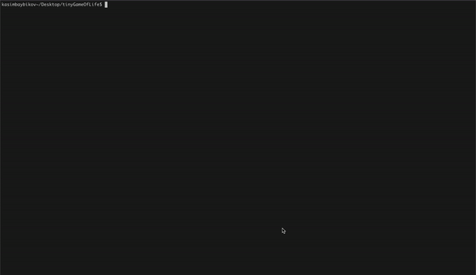

# tinyGameOfLife

Implementation of a finite cellular automaton on the example of the [Game of Life](https://en.wikipedia.org/wiki/Conway%27s_Game_of_Life).

## Usage
An auxiliary message will appear after `make`

## Game
***To start the simulation, you need `make` and run `./game` or by passing the path to the map `./game <path_to_start_map>`***
## Map Generator
***To generate a new map use ./mapGenerate [map_name] [filling density] (option) [symbol] (option)***
